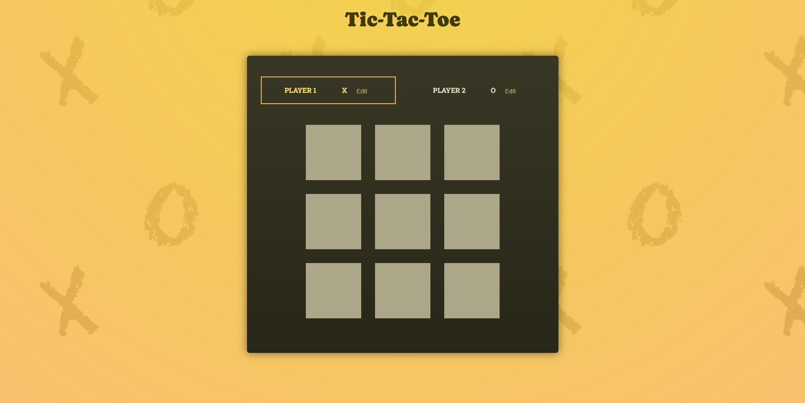

# Tic-tac-toe

This project is a tic-tac-toe game made with React to explore the core concepts of this framework, such as state management, two-way binding, splitting apps into components, and more!

Thanks to [@maxschwarzmueller](https://github.com/maxschwarzmueller) who provided the base project.